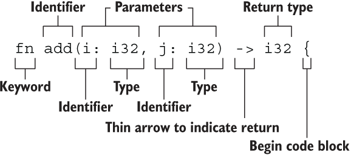

## 基础

* 有符号整数

  * i8, i16, i32, i64, isize
* 无符号整数

  * u8, u16,u32,u64,usize
* 浮点

  * f32, f64
* 字符串

  * 字面量
  * 字符串切片:&str
* bool
* 字符类型

  * 表示单个Unicode字符, 存储为4个字节
* 单元类型

  * ()

## 数值类型

* 整数

  * 定义:  有无符号+类型大小(位数)
  * 长度

    * 有符号: -(2^n - 1^) ~ 2^n - 1^ - 1,符号以[补码](https://zh.wikipedia.org/wiki/%E4%BA%8C%E8%A3%9C%E6%95%B8)存在
    * 无符号: 0 ~ 2^n^ - 1
  * 默认使用`i32`​, 例如 `let i = 1`
  * 整型溢出

    * --release模式下不检测, 按照补码循环溢出
    * 显示处理溢出

      * 使用 `wrapping_*`​ 方法在所有模式下都按照补码循环溢出规则处理，例如 `wrapping_add`​
      * 如果使用 `checked_*`​ 方法时发生溢出，则返回 `None`​ 值
      * 使用 `overflowing_*`​ 方法返回该值和一个指示是否存在溢出的布尔值
      * 使用 `saturating_*`​ 方法使值达到最小值或最大值
* 浮点类型

  * 定义: 带有小数的数字, f32为单精度, f64为双精度
  * 浮点数陷阱

    * 数字的近似表达
    * 某些特性反直觉
    * 需要遵守原则

      * 避免浮点数上测试相等性
      * 结果在数学上存在未定义时需要注意
  * Nan

    * nan操作都会返回nan
    * 可以使用is_nan()判断结果
* 数字运算

  *  = - * / %
* 位运算

  * |运算符|说明|
    | ---------| --------------------------------------------------------|
    |& 位与|相同位置均为1时则为1，否则为0|
    ||位或|
    |^ 异或|相同位置不相同则为1，相同则为0|
    |! 位非|把位中的0和1相互取反，即0置为1，1置为0|
    |<< 左移|所有位向左移动指定位数，右位补0|
    |>> 右移|所有位向右移动指定位数，带符号移动（正数补0，负数补1）|

* 序列(Range)

  * 1..=5 = [1,2,3,4,5]
  * 1..5 = [1,2,3,4]
* 有理数和复数

  * 数值库: [num](https://crates.io/crates/num)
* 总结

  * 需要熟悉类型所占用的字节数, 即可知道类型允许的大小范围以及能否表达负数
  * 类型转换必须显式
  * 数值上可以使用方法, 例如取整: `13.14_f32.round()`

‍

‍

## 字符类型

* Rust中所有Unicode都可以作为字符
* 字符占4个字节(Unicode占4字节)
* 使用`''`​

## 布尔

* true
* false
* 占用1个字节

## 单元类型

* ()
* main函数返回该值

  * 没有返回值的函数: 发散函数(diverge function)
* ‍

## 语句和表达式

```rust
fn add_with_extra(x: i32, y: i32) -> i32 {
    let x = x + 1; // 语句
    let y = y + 5; // 语句
    x + y // 表达式
}
```

* 语句

  * 完成了一个具体的操作，但是并没有返回值
  * 由于 `let`​ 是语句，因此不能将 `let`​ 语句赋值给其它值
* 表达式

  * 进行求值，然后返回一个值
  * **表达式不能包含分号**

## 函数

​​

* 要点

  *  

    * 函数名和变量名使用[蛇形命名法(snake case)](https://course.rs/practice/naming.html)，例如 `fn add_two() -> {}`​
    * 函数的位置可以随便放，Rust 不关心我们在哪里定义了函数，只要有定义即可
    * 每个函数参数都需要标注类型
* 发散函数 !

  * 会导致程序崩溃
* ‍

‍

‍
