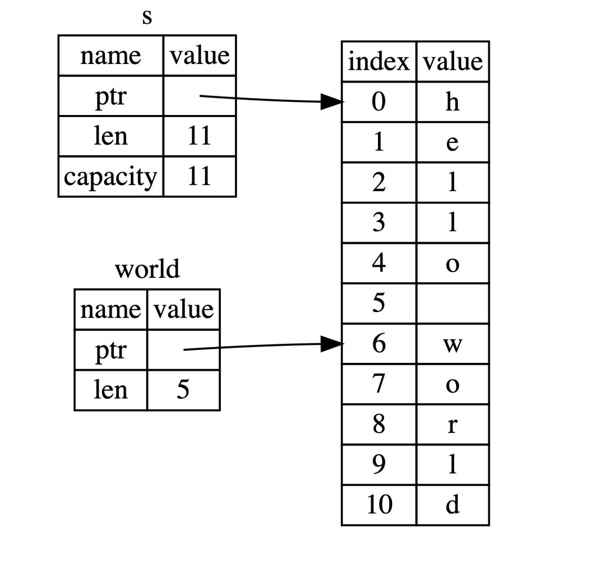
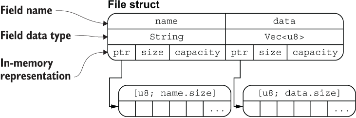

### 字符串

#### 切片(slice)

* 允许你引用集合中部分连续的元素序列

  * ​​
* 形式

  * 起始 - 指定结束:  `&s[0..2]; &s[..2];`​
  * 指定起始 - 最后 `&s[4..len]; &s[4..];`​
  * 全部: `&s[0..len]; &s[..];`​
* 注意

  * 在对字符串使用切片语法时需要格外小心，切片的索引必须落在字符之间的边界位置, 具体: [操作 UTF-8 字符串](https://course.rs/basic/compound-type/string-slice.html#%E6%93%8D%E4%BD%9C-utf-8-%E5%AD%97%E7%AC%A6%E4%B8%B2 "操作 UTF-8 字符串")

* 字符串字面量: &str
* Rust 中的字符是 Unicode 类型, 每个字符占用 4 个字节
* 字符串是 UTF-8 编码, 所占字节数是变化的(1-4)
* 标准库中字符串类型

  * String
* String 到&str 转换

  * ```Rust
    fn main() {
        let s = String::from("hello,world!");
        say_hello(&s); // 取引用
        say_hello(&s[..]);
        say_hello(s.as_str());
    }

    fn say_hello(s: &str) {
        println!("{}",s);
    }
    ```
* 字符串索引

  * 不允许
  * 内部

    * 存储格式为[u8], 中文与英文所占字节不同,通过索引获取并不正确
  * 性能

    * 预计是 O(1), 实际需要从 0 开始遍历
* 字符串切片

  * 因为切片的索引是通过字节来进行，但是字符串又是**​ UTF-8 编码**，因此你**无法**保证索引的字节刚好落在字符的边界上
* 操作字符串

  * 追加(Push):

    * **在原有的字符串上追加，并不会返回新的字符串**
    * **字符串变量必须由 ​**​**`mut`**​**​ 关键字修饰**
    * 使用 `push()`​ 方法追加字符 `char`​
    * ​`push_str()`​ 方法追加字符串字面量
  * 插入(Insert):

    * **修改原来的字符串**
    * **字符串变量必须由 ​**​**`mut`**​**​ 关键字修饰**
    * ​`insert()`​ 方法插入单个字符 `char`​
    * ​`insert_str()`​ 方法插入字符串字面量
    * 需要传入两个参数，第一个参数是字符（串）插入位置的索引，第二个参数是要插入的字符（串），索引从 0 开始计数
  * 替换(Replace):

    * ​`replace`​

      * **返回一个新的字符串，而不是操作原来的字符串**
      * 适用于 String, &str
      * 接收两个参数，第一个参数是要被替换的字符串，第二个参数是新的字符串
    * `replacen`

      * **返回一个新的字符串，而不是操作原来的字符串**
      * 适用于 String, &str
      * 接收三个参数，前两个参数与 `replace()`​ 方法一样，第三个参数则表示替换的个数
    * `replace_range`

      * **直接操作原来的字符串，不会返回新的字符串**
      * **该方法需要使用 ​**​**`mut`**​**​ 关键字修饰**
      * 仅适用于 `String`​ 类型
      * 接收两个参数，第一个参数是要替换字符串的范围（Range），第二个参数是新的字符串
  * 删除(Delete)

    * 仅适用于 `String`​ 类型
    * `pop()`
      * 删除并返回字符串的最后一个字符
      * **直接操作原来的字符串**
      * 返回值是一个 `Option`​ 类型，如果字符串为空，则返回 `None`​
    * `remove()`
      * 删除并返回字符串中指定位置的字符
      * **直接操作原来的字符串**
      * 只接收一个参数，表示该字符起始索引位置
      * 参数所给的位置不是合法的字符边界，则会发生错误
      * 返回值是删除位置的字符串
    * `truncate()`
      * 删除字符串中从指定位置开始到结尾的全部字符
      * **直接操作原来的字符串**
      * 按照字节来处理字符串的，如果参数所给的位置不是合法的字符边界，则会发生错误
      * 无返回值
    * `clear()`
      * 清空字符串
      * **直接操作原来的字符串**
      * 相当于 `truncate()`​ 方法参数为 0
  * 连接(Concatenate)

    * ​`+`​ 或者 `+=`​ 连接字符串

      * 要求右边的参数必须为字符串的切片引用（Slice）类型
      * **返回一个新的字符串, 不需要 ​**​**`mut`**​**​ 关键字修饰**
    * ​`format!`​ 连接字符串

      * 适用于 `String`​ 和 `&str`​
* 字符串转义

  * 转义的方式 `\`​ 输出 ASCII 和 Unicode 字符
* 操作 UTF-8 字符串

  * 字符

    * 以 Unicode 字符的方式遍历字符串，使用 `chars`​ 方法
  * 字节

    * 返回字符串的底层字节数组表现形式, 使用 `bytes`​ 方法
  * 获取子串

    * 使用这个库：[utf8_slice](https://crates.io/crates/utf8_slice)
* 深度刨析

  * String 类型

    * 为了支持一个可变、可增长的文本片段，需要在堆上分配一块在编译时未知大小的内存来存放内容
    * 操作步骤

      * 首先向操作系统请求内存来存放 `String`​ 对象
      * 在使用完成后，将内存释放，归还给操作系统
    * 内存释放: 变量在离开作用域后，就自动释放其占用的内存

## 元组

* 获取值

  * 模式匹配: 元组是 `(n1, n2, n3)`​ 形式的，用 `(x, y, z)`​ 形式来进行匹配
  * 用. 访问: 元组的索引从 0 开始

## 结构体

* 其他语言: obejct, record

### 语法

* 定义结构体

  * 通过关键字 `struct`​ 定义
  * 一个清晰明确的结构体 `名称`​
  * 几个有名字的结构体 `字段`​
  * ```Rust
    struct User {
        active: bool,
        username: String,
        email: String,
        sign_in_count: u64,
    }
    ```

* 创建结构体实例

  * ```Rust
    let user1 = User {
            email: String::from("someone@example.com"),
            username: String::from("someusername123"),
            active: true,
            sign_in_count: 1,
        };
    ```
  * 注意点

    * 初始化实例时，**每个字段**都需要进行初始化
    * 初始化时的字段顺序**不需要**和结构体定义时的顺序一致
* 访问结构体字段

  * 通过 `.`​ 操作符即可访问
  * 可以修改它们, 必须要将结构体实例声明为可变的
* 简化结构体创建

  * ```Rust

    #![allow(unused)]
    fn main() {
    	fn build_user(email: String, username: String) -> User {
    	    User {
    	        email,
    	        username,
    	        active: true,
    	        sign_in_count: 1,
    	    }
    	}
    }
    ```

* 结构体更新

  * ```Rust
    let user2 = User {
            email: String::from("another@example.com"),
            ..user1
        };

    ```
  * ​`user1`​ 的部分字段所有权被转移到 `user2`​ 中：`username`​ 字段发生了所有权转移，作为结果，`user1`​ 无法再被使用
  * 实现了 `Copy`​ 特征的类型无需所有权转移，可以直接在赋值时进行 数据拷贝，其中 `bool`​ 和 `u64`​ 类型就实现了 `Copy`​ 特征

### 结构体内存排列

* ```Rust
  #[derive(Debug)]
   struct File {
     name: String,
     data: Vec<u8>,
   }

   fn main() {
     let f1 = File {
       name: String::from("f1.txt"),
       data: Vec::new(),
     };

     let f1_name = &f1.name;
     let f1_length = &f1.data.len();

     println!("{:?}", f1);
     println!("{} is {} bytes long", f1_name, f1_length);
   }
  ```
* ​​
* **把结构体中具有所有权的字段转移出去后，将无法再访问该字段，但是可以正常访问其它的字段**。

‍

### 其他结构体

* 元组结构体(Tuple Struct)

  * 结构体必须要有名称，但是结构体的字段可以没有名称

    * ```Rust
       struct Color(i32, i32, i32);
       struct Point(i32, i32, i32);
      ```
* 单元结构体(Unit-like Struct)

  * 你定义一个类型，但是不关心该类型的内容, 只关心它的行为时

‍

### 结构体数据所有权

* 想在结构体中使用一个引用，就必须加上生命周期，否则就会报错

‍

### 使用 #[derive(Debug)] 打印结构体信息

* 使用 `{}`​ 来格式化输出，那对应的类型就必须实现 `Display`​ 特征, 基本类型都默认实现了该特征
* 自己实现 `Display`​ 特征

‍

## 枚举

* **枚举类型是一个类型，它会包含所有可能的枚举成员, 而枚举值是该类型中的具体某个成员的实例。**

### 枚举值

* **任何类型的数据都可以放入枚举成员中**

  * 字符串、数值、结构体甚至另一个枚举

### 同一化类型

* 多态?

```Rust
#![allow(unused)]
fn main() {
	fn new (stream: TcpStream) {
	  let mut s = stream;
	  if tls {
	    s = negotiate_tls(stream)
	  }

	  // websocket是一个WebSocket<TcpStream>或者
	  //   WebSocket<native_tls::TlsStream<TcpStream>>类型
	  websocket = WebSocket::from_raw_socket(
	    stream, ......)
	}
}


#![allow(unused)]
fn main() {
	enum Websocket {
	  Tcp(Websocket<TcpStream>),
	  Tls(Websocket<native_tls::TlsStream<TcpStream>>),
	}
}

```

### Option 枚举处理空值

```RUst
enum Option<T> {
    Some(T),
    None,
}
```

* ​`Option<T>`​ 和 `T`​（这里 `T`​ 可以是任何类型）是不同的类型
* 在对 `Option<T>`​ 进行 `T`​ 的运算之前必须将其转换为 `T`​
* 为了拥有一个可能为空的值，你必须要显式的将其放入对应类型的 `Option<T>`​ 中。接着，当使用这个值时，必须明确的处理值为空的情况。只要一个值不是 `Option<T>`​ 类型，你就 **可以** 安全的认定它的值不为空

## 数组

**数组是 Rust 的基本类型，是固定长度的，这点与其他编程语言不同，其它编程语言的数组往往是可变长度的，与 Rust 中的动态数组 ​**​**`Vector`**​

* 特征

  * 长度固定
  * 元素必须有相同的类型
  * 依次线性排列

### 创建

* **数组 ​**​**`array`**​**​ 是存储在栈上, 动态数组 ​**​**`Vector`**​**​ 是存储在堆上**

* **数组声明类型**

  ```Rust
  let a: [i32; 5] = [1, 2, 3, 4, 5];
  // 数组类型是通过方括号语法声明，i32 是元素类型，分号后面的数字 5 是数组长度
  ```

* 简写

  * ```Rust
    let a = [3; 5];
    // [类型; 长度]
    ```

### 访问

* 通过索引的方式来访问存放其中的元素

* 越界访问

  * 当你尝试使用索引访问元素时，Rust 将检查你指定的索引是否**小于**数组长度。如果索引大于或等于数组长度，Rust 会出现 ***panic***。这种检查只能在运行时进行
* 数组元素为非基础类型

  * **基本类型在Rust中赋值是以Copy的形式, 复杂类型默认没有实现深拷贝**
  * 正确写法: 调用 `std::array::from_fn`​

    * ```Rust
      let array: [String; 8] = core::array::from_fn(|i| String::from("rust is good!"));

      println!("{:#?}", array);
      ```

### 数组切片

* 切片特点

  * 切片的长度可以与数组不同，并不是固定的，而是取决于你使用时指定的起始和结束位置
  * 创建切片的代价非常小，因为切片只是针对底层数组的一个引用
  * 切片类型[T]拥有不固定的大小，而切片引用类型&[T]则具有固定的大小，因为 Rust 很多时候都需要固定大小数据类型，因此&[T]更有用,`&str` ​字符串切片也同理

### 总结

* ​**数组类型容易跟数组切片混淆**​，[T;n]描述了一个数组的类型，而[T]描述了切片的类型， 因为切片是运行期的数据结构，它的长度无法在编译期得知，因此不能用[T;n]的形式去描述
* ​`[u8; 3]` ​和 `[u8; 4]` ​是不同的类型，数组的长度也是类型的一部分
* ​**在实际开发中，使用最多的是数组切片[T]**​，我们往往通过引用的方式去使用 `&[T]`​，因为后者有固定的类型大小

‍
