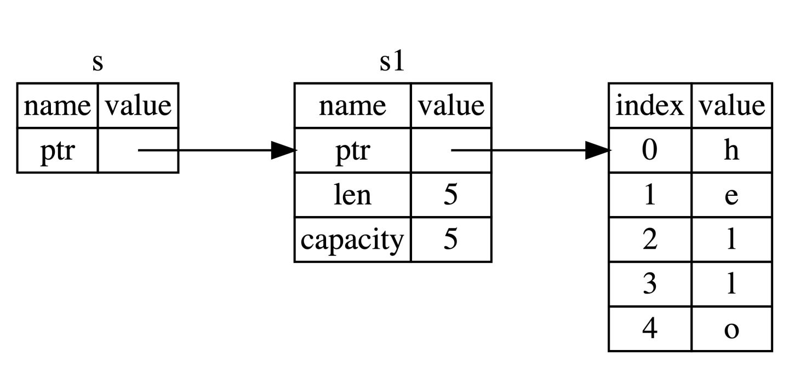

## 引用与解引用

* 引用

  * 指针类型, 指向 了对象存储的内存地址
  * &
* 解引用

  * 必须使用解引用运算符解出引用所指向的值
  * *

## 不可变引用

* ​`&`​ 符号即是引用，它们允许你使用值，但是不获取所有权

  * ​​
* 引用指向的值默认也是不可变的

  * ```rust
    fn main() {
        let s = String::from("hello");

        change(&s);
    }

    fn change(some_string: &String) {
        some_string.push_str(", world");
    }

    error[E0596]: cannot borrow `*some_string` as mutable, as it is behind a `&` reference
     --> src/main.rs:8:5
      |
    7 | fn change(some_string: &String) {
      |                        ------- help: consider changing this to be a mutable reference: `&mut String`
                               ------- 帮助：考虑将该参数类型修改为可变的引用: `&mut String`
    8 |     some_string.push_str(", world");
      |     ^^^^^^^^^^^ `some_string` is a `&` reference, so the data it refers to cannot be borrowed as mutable
                         `some_string`是一个`&`类型的引用，因此它指向的数据无法进行修改

    ```

## 可变引用

```rust
error[E0499]: cannot borrow `s` as mutable more than once at a time 同一时间无法对 `s` 进行两次可变借用
 --> src/main.rs:5:14
  |
4 |     let r1 = &mut s;
  |              ------ first mutable borrow occurs here 首个可变引用在这里借用
5 |     let r2 = &mut s;
  |              ^^^^^^ second mutable borrow occurs here 第二个可变引用在这里借用
6 |
7 |     println!("{}, {}", r1, r2);
  |                        -- first borrow later used here 第一个借用在这里使用
```

* 限制: **同一作用域，特定数据只能有一个可变引用**

  * 两个或更多的指针同时访问同一数据
  * 至少有一个指针被用来写入数据
  * 没有同步数据访问的机制
* 大括号可以帮我们解决一些编译不通过的问题，通过手动限制变量的作用域

  * ```rust

    #![allow(unused)]
    fn main() {
    	let mut s = String::from("hello");

    	{
    	    let r1 = &mut s;

    	} // r1 在这里离开了作用域，所以我们完全可以创建一个新的引用

    	let r2 = &mut s;
    }

    ```

* 可变引用与不可变引用不能同时存在

  * 注意，引用的作用域 `s`​ 从创建开始，一直持续到它最后一次使用的地方，这个跟变量的作用域有所不同，变量的作用域从创建持续到某一个花括号 `}`​

    * **引用作用域的结束位置从花括号变成最后一次使用的位置**
  * 正在借用不可变引用的用户，肯定**不希望**他借用的东西，被另外一个人莫名其妙**改变**了。多个不可变借用被允许是因为**没有人会去试图修改数据**，每个人都**只读**这一份数据而不做修改，因此不用担心数据被污染
  * **Non-Lexical Lifetimes(NLL): ​**专门用于找到某个引用在作用域(`}`​)结束前就不再被使用的代码位置。
* 悬垂引用(Dangling Reference)

  * 指针指向某个值后，这个值被释放掉了，而指针仍然存在，其指向的内存可能不存在任何值或已被其它变量重新使用
  * ```rust
    fn dangle() -> &String { // dangle 返回一个字符串的引用

        let s = String::from("hello"); // s 是一个新字符串

        &s // 返回字符串 s 的引用
    } // 这里 s 离开作用域并被丢弃。其内存被释放。
      // 危险！
    ```

* 借用规则总结

  * 同一时刻，你只能拥有要么一个可变引用, 要么任意多个不可变引用
  * 引用必须总是有效的
