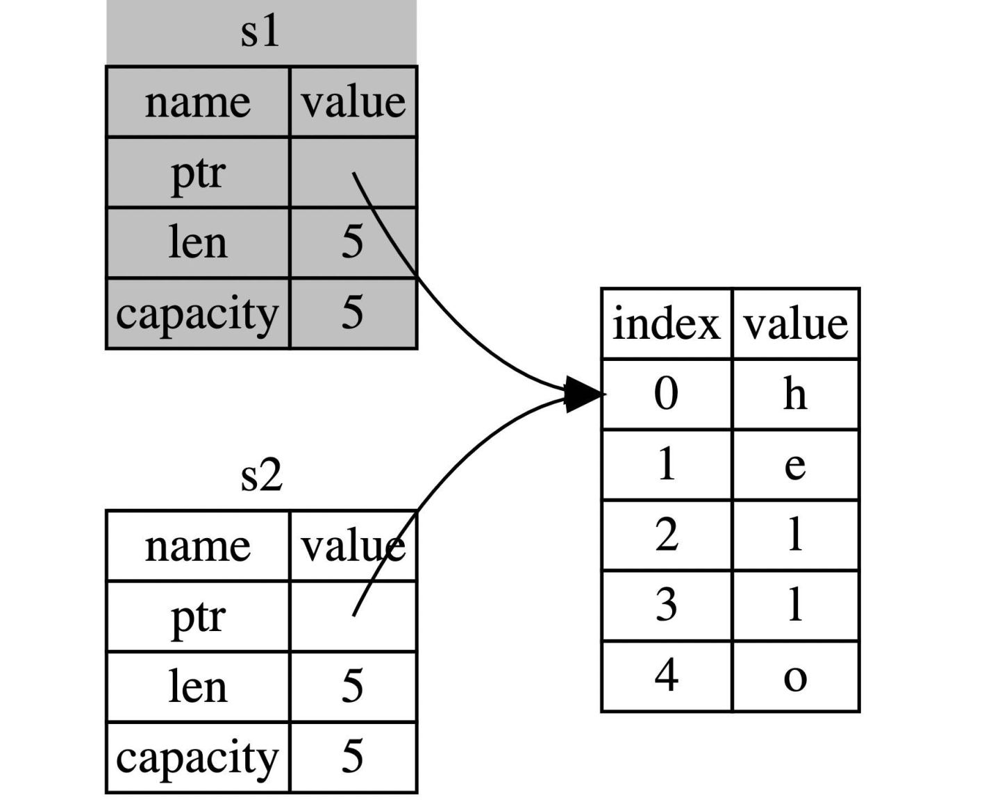

## [栈(Stack)与堆(Heap)](https://course.rs/basic/ownership/ownership.html#%E6%A0%88stack%E4%B8%8E%E5%A0%86heap)

### 栈

* 按照顺序存储并以相反顺序取出
* 后进先出
* 增加数据**进栈**,移出数据**出栈**
* 所有数据必须占用已知且固定大小的内存空间

### 堆

* 大小未知或可能变化的数据存储在堆上
* 在堆上分配内存,简称"分配"(allocating)

  * 放入数据, 请求一定大小的内存空间
  * 操作系统在堆的某处找到足够大的空位
  * 标记为已使用
  * 返回一个表示该位置地址的指针
  * 指针被推入栈中
  * 后续通过栈中的指针来获取堆上的实际内存位置
* 一种缺乏组织的数据结构

### 性能区别

* 写入: 入栈 > 堆分配, 原因: 堆处理需要经过操作系统
* 读取: 堆 < 栈, 原因: 栈数据可以直接存在CPU高速缓存上, 并且堆需要经过栈访问

### 所有权与堆栈

* 调用函数, 传递给函数的参数依次压入栈中
* 调用结束, 值将被从栈中按相反顺序依次移除

### 所有权原则

* Rust中每一个值都被一个变量所拥有, 该变量被称为值的所有者
* 一个值同时只能被一个变量所拥有, 或者一个值只能拥有一个所有者
* 当所有者(变量)离开作用域范围时, 这个值将被丢弃

#### 变量作用域

```rust
{                      // s 在这里无效，它尚未声明
    let s = "hello";   // 从此处起，s 是有效的

    // 使用 s
}                      // 此作用域已结束，s不再有效
```

* 和其他语言类似

### 变量绑定背后的数据交互

#### 转移所有权

* 基本数据类型,是固定大小的简单值, 可以通过自动拷贝赋值
* String是复杂类型, 存储在堆上, 不能自动拷贝

  * 由**存储在栈中的堆指针**、**字符串长度**、**字符串容量**共同组成
* 二次释放(double free)

  * 两个变量指向同一个位置
  * 离开作用域时, 释放相同内存
* Rust解决方案

  * **当 ​**​**`s1`**​**​ 赋予 ​**​**`s2`**​**​ 后，Rust 认为 ​**​**`s1`**​**​ 不再有效，因此也无需在 ​**​**`s1`**​**​ 离开作用域后 ​**​**`drop`**​**​ 任何东西，这就是把所有权从 ​**​**`s1`**​**​ 转移给了 ​**​**`s2`**​**，**​**`s1`**​**​ 在被赋予 ​**​**`s2`**​**​ 后就马上失效了**
* 移动(Move), Rust会使第一个变量失效, 转移所有权

  * ​
* Rust 称呼 `let a = b`​ 为**变量绑定**

* #### [克隆(深拷贝)](https://course.rs/basic/ownership/ownership.html#%E5%85%8B%E9%9A%86%E6%B7%B1%E6%8B%B7%E8%B4%9D)

  * **Rust 永远也不会自动创建数据的 “深拷贝”**

    * ```rust
      let s1 = String::from("hello");
      let s2 = s1.clone();

      println!("s1 = {}, s2 = {}", s1, s2);
      ```
* #### [拷贝(浅拷贝)](https://course.rs/basic/ownership/ownership.html#%E6%8B%B7%E8%B4%9D%E6%B5%85%E6%8B%B7%E8%B4%9D)

  * ```rust
    let x = 5;
    let y = x;

    println!("x = {}, y = {}", x, y);
    ```
  * 上述代码是在栈上进行了"深拷贝"
  * 如果一个类型拥有 `Copy`​ 特征，一个旧的变量在被赋值给其他变量后仍然可用

    * **任何基本类型的组合可以 ​**​**`Copy`**​**​ ，不需要分配内存或某种形式资源的类型是可以 ​**​**`Copy`**​**​ 的**
    * 所有整数类型，比如 `u32`​。
    * 布尔类型，`bool`​，它的值是 `true`​ 和 `false`​。
    * 所有浮点数类型，比如 `f64`​。
    * 字符类型，`char`​。
    * 不可变引用 `&T`​ ，例如[转移所有权](https://course.rs/basic/ownership/ownership.html#%E8%BD%AC%E7%A7%BB%E6%89%80%E6%9C%89%E6%9D%83)中的最后一个例子，**但是注意: 可变引用 ​**​**`&mut T`**​**​ 是不可以 Copy的**
    * 元组，当且仅当其包含的类型也都是 `Copy`​ 的时候。比如，`(i32, i32)`​ 是 `Copy`​ 的，但 `(i32, String)`​ 就不是。

### 函数传值与返回

```rust
fn main() {
    let s = String::from("hello");  // s 进入作用域

    takes_ownership(s);             // s 的值移动到函数里 ...
                                    // ... 所以到这里不再有效

    let x = 5;                      // x 进入作用域

    makes_copy(x);                  // x 应该移动函数里，
                                    // 但 i32 是 Copy 的，所以在后面可继续使用 x

} // 这里, x 先移出了作用域，然后是 s。但因为 s 的值已被移走，
  // 所以不会有特殊操作

fn takes_ownership(some_string: String) { // some_string 进入作用域
    println!("{}", some_string);
} // 这里，some_string 移出作用域并调用 `drop` 方法。占用的内存被释放

fn makes_copy(some_integer: i32) { // some_integer 进入作用域
    println!("{}", some_integer);
} // 这里，some_integer 移出作用域。不会有特殊操作
```

* 函数返回值的所有权

```rust
fn main() {
    let s1 = gives_ownership();         // gives_ownership 将返回值
                                        // 移给 s1

    let s2 = String::from("hello");     // s2 进入作用域

    let s3 = takes_and_gives_back(s2);  // s2 被移动到
                                        // takes_and_gives_back 中,
                                        // 它也将返回值移给 s3
} // 这里, s3 移出作用域并被丢弃。s2 也移出作用域，但已被移走，
  // 所以什么也不会发生。s1 移出作用域并被丢弃

fn gives_ownership() -> String {             // gives_ownership 将返回值移动给
                                             // 调用它的函数

    let some_string = String::from("hello"); // some_string 进入作用域.

    some_string                              // 返回 some_string 并移出给调用的函数
}

// takes_and_gives_back 将传入字符串并返回该值
fn takes_and_gives_back(a_string: String) -> String { // a_string 进入作用域

    a_string  // 返回 a_string 并移出给调用的函数
}
```

‍
