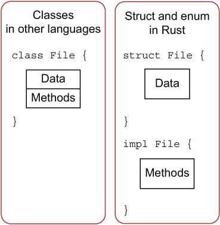

## 定义

使用 `impl`​ 来定义方法

```rust
impl Circle {
    // new是Circle的关联函数，因为它的第一个参数不是self，且new并不是关键字
    // 这种方法往往用于初始化当前结构体的实例
    fn new(x: f64, y: f64, radius: f64) -> Circle {
        Circle {
            x: x,
            y: y,
            radius: radius,
        }
    }

    // Circle的方法，&self表示借用当前的Circle结构体
    fn area(&self) -> f64 {
        std::f64::consts::PI * (self.radius * self.radius)
    }
}
```

​​

```rust
#[derive(Debug)]
struct Rectangle {
    width: u32,
    height: u32,
}

impl Rectangle {
    fn area(&self) -> u32 {
        self.width * self.height
    }
}

fn main() {
    let rect1 = Rectangle { width: 30, height: 50 };

    println!(
        "The area of the rectangle is {} square pixels.",
        rect1.area()
    );
}
```

### self、&self 和 &mut self

​`self`​ 依然有所有权的概念：

* ​`self`​ 表示 `Rectangle`​ 的所有权转移到该方法中，这种形式用的较少
* ​`&self`​ 表示该方法对 `Rectangle`​ 的不可变借用
* ​`&mut self`​ 表示可变借用

使用方法代替函数有以下好处：

* 不用在函数签名中重复书写 `self`​ 对应的类型
* 代码的组织性和内聚性更强，对于代码维护和阅读来说，好处巨大

### 方法名跟结构体字段名相同

```rust
impl Rectangle {
    fn width(&self) -> bool {
        self.width > 0
    }
}

fn main() {
    let rect1 = Rectangle {
        width: 30,
        height: 50,
    };

    if rect1.width() {
        println!("The rectangle has a nonzero width; it is {}", rect1.width);
    }
}

```

* 使用 `rect1.width()`​ 时，Rust 知道我们调用的是它的方法，
* 如果使用 `rect1.width`​，则是访问它的字段

## 多个参数的方法

```rust
fn can_hold(&self, other: &Rectangle) -> bool {
        self.width > other.width && self.height > other.height
    }
```

## 关联函数(Associated function)

* 定义在 `impl`​ 中且没有 `self`​ 的函数被称之为**关联函数**

  * 因为它没有 `self`​，不能用 `f.read()`​ 的形式调用，因此它是一个函数而不是方法，它又在 `impl`​ 中，与结构体紧密关联
* Rust 中有一个约定俗成的规则，使用 `new`​ 来作为构造器的名称，出于设计上的考虑，Rust 特地没有用 `new`​ 作为关键字
* 因为是函数，所以不能用 `.`​ 的方式来调用，我们需要用 `::`​ 来调用

## 多个impl定义

* 允许我们为一个结构体定义多个 `impl`​ 块，目的是提供更多的灵活性和代码组织性

  * 当方法多了后，可以把相关的方法组织在同一个 `impl`​ 块中

‍

## 为枚举实现方法

```rust
#![allow(unused)]
enum Message {
    Quit,
    Move { x: i32, y: i32 },
    Write(String),
    ChangeColor(i32, i32, i32),
}

impl Message {
    fn call(&self) {
        // 在这里定义方法体
    }
}

fn main() {
    let m = Message::Write(String::from("hello"));
    m.call();
}

```

‍
