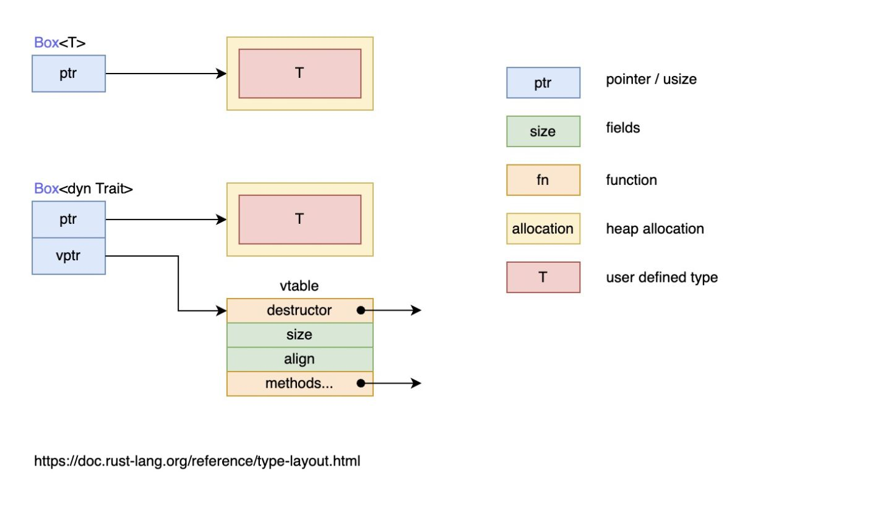

## 泛型

### 泛型参数

* 默认使用T
* 先决条件: 使用前对其进行声明

  * ```rust
    fn largest<T>(list: &[T]) -> T {
    ```
* 限制

  * **可比较的功能 : std::cmp::PartialOrd**
  * **相加操作: std::ops::Add&lt;Output = T&gt;**

### 结构体中使用泛型

* 注意点

  * ​**提前声明**​，跟泛型函数定义类似，首先我们在使用泛型参数之前必需要进行声明 `Point<T>`​，接着就可以在结构体的字段类型中使用 `T`​ 来替代具体的类型
  * **x 和 y 是相同的类型**

### 枚举中使用泛型

* ```rust
  enum Result<T, E> {
      Ok(T),
      Err(E),
  }
  ```

### 方法中使用泛型

```rust
struct Point<T, U> {
    x: T,
    y: U,
}

impl<T, U> Point<T, U> { // 结构体泛型
    // 函数泛型
    fn mixup<V, W>(self, other: Point<V, W>) -> Point<T, W> {
        Point {
            x: self.x,
            y: other.y,
        }
    }
}

fn main() {
    let p1 = Point { x: 5, y: 10.4 };
    let p2 = Point { x: "Hello", y: 'c'};

    let p3 = p1.mixup(p2);

    println!("p3.x = {}, p3.y = {}", p3.x, p3.y);
}

```

### const泛型

```rust
fn display_array<T: std::fmt::Debug, const N: usize>(arr: [T; N]) {
    println!("{:?}", arr);
}
fn main() {
    let arr: [i32; 3] = [1, 2, 3];
    display_array(arr);

    let arr: [i32; 2] = [1, 2];
    display_array(arr);
}
```

* 定义了一个类型为 `[T; N]`​ 的数组

  * ​`T`​ 是一个基于类型的泛型参数
  * ​`N`​ 就是 const 泛型, 语法: `const N: usize`
* const泛型表达式

  * ```rust
    fn something<T>(val: T)
    where
        Assert<{ core::mem::size_of::<T>() < 768 }>: IsTrue,
        //       ^-----------------------------^ 这里是一个 const 表达式，换成其它的 const 表达式也可

    ```

### 泛型的性能

* 泛型是零成本的抽象
* 缺陷: 损失了编译速度和增大了最终生成文件的大小
* **单态化**(*monomorphization*)

  * 单态化是一个通过填充编译时使用的具体类型，将通用代码转换为特定代码的过程
  * 编译器寻找所有泛型代码被调用的位置并针对具体类型生成代码
* 编译器生成效果

  * ```rust
    enum Option_i32 {
        Some(i32),
        None,
    }

    enum Option_f64 {
        Some(f64),
        None,
    }

    fn main() {
        let integer = Option_i32::Some(5);
        let float = Option_f64::Some(5.0);
    }
    ```

‍

## 特征

### 定义

* 把一些方法组合在一起，定义一个实现某些目标所必需的行为的集合

  * 类似接口
* 使用 `trait`​ 关键字

### 为类型实现特征

```rust
pub trait Summary {
    fn summarize(&self) -> String;
}
pub struct Post {

}

impl Summary for Post {
    fn summarize(&self) -> String {
        format!("文章{}, 作者是{}", self.title, self.author)
    }
}
```

* 为 `Post`​ 类型实现 `Summary`​ 特征
* 在 `impl`​ 的花括号中实现该特征的具体方法

#### 特征的定义与实现的位置（孤儿规则）

* 孤儿规则

  * 为类型A实现特征T，那么A或者T至少有一个在当前作用域中定义
  * 避免他人代码不会破坏你的代码

#### 默认实现

```rust

#![allow(unused)]
fn main() {
	pub trait Summary {
	    fn summarize(&self) -> String {
	        String::from("(Read more...)")
	    }
	}
}

```

### 使用特征作为函数

```rust
pub fn notify(item: &impl Summary) {
    println!("Breaking news! {}", item.summarize());
}
```

* **实现了**​**`Summary`**​**特征** 的 `item`​ 参数

### 特征约束（trait bound)

```rust
pub fn notify<T: Summary>(item: &T) {
    println!("Breaking news! {}", item.summarize());
}

pub fn notify<T: Summary>(item1: &T, item2: &T) {}
```

* 形如 `T: Summary`​ 被称为**特征约束**

* 多重约束

  * `T: Summary + Display`
* where约束

  * ```rust
    fn some_function<T, U>(t: &T, u: &U) -> i32
        where T: Display + Clone,
              U: Clone + Debug
    {}
    ```

### 函数中返回的impl Trait

* 通过 `impl Trait`​ 来说明一个函数返回了一个类型

  * ```rust
    fn returns_summarizable() -> impl Summary {
        Weibo {
            username: String::from("sunface"),
            content: String::from(
                "m1 max太厉害了，电脑再也不会卡",
            )
        }
    }
    ```

### 通过derive派生特征

* ## [附录 D：派生特征 trait](https://course.rs/appendix/derive.html#%E9%99%84%E5%BD%95-d%E6%B4%BE%E7%94%9F%E7%89%B9%E5%BE%81-trait)

### 调用方法需要引入特征

* 使用 `as`​ 关键字做类型转换会有比较大的限制，因为你想要在类型转换上拥有完全的控制，例如处理转换错误，那么你将需要 `TryInto`

  ```rust
  use std::convert::TryInto;

  fn main() {
    let a: i32 = 10;
    let b: u16 = 100;

    let b_ = b.try_into()
              .unwrap();

    if a < b_ {
      println!("Ten is less than one hundred.");
    }
  }
  ```

* **如果你要使用一个特征的方法，那么你需要将该特征引入当前的作用域中**

## 特征对象

### 特征对象定义

* **特征对象**指向实现了特征的类型的实例

  * 这种映射关系是存储在一张表中，可以在运行时通过特征对象找到具体调用的类型方法
* 通过 `&`​ 引用或者 `Box<T>`​ 智能指针的方式来创建特征对象

```rust
trait Draw {
    fn draw(&self) -> String;
}

impl Draw for u8 {
    fn draw(&self) -> String {
        format!("u8: {}", *self)
    }
}

impl Draw for f64 {
    fn draw(&self) -> String {
        format!("f64: {}", *self)
    }
}

// 若 T 实现了 Draw 特征， 则调用该函数时传入的 Box<T> 可以被隐式转换成函数参数签名中的 Box<dyn Draw>
fn draw1(x: Box<dyn Draw>) {
    // 由于实现了 Deref 特征，Box 智能指针会自动解引用为它所包裹的值，然后调用该值对应的类型上定义的 `draw` 方法
    x.draw();
}

fn draw2(x: &dyn Draw) {
    x.draw();
}

fn main() {
    let x = 1.1f64;
    // do_something(&x);
    let y = 8u8;

    // x 和 y 的类型 T 都实现了 `Draw` 特征，因为 Box<T> 可以在函数调用时隐式地被转换为特征对象 Box<dyn Draw> 
    // 基于 x 的值创建一个 Box<f64> 类型的智能指针，指针指向的数据被放置在了堆上
    draw1(Box::new(x));
    // 基于 y 的值创建一个 Box<u8> 类型的智能指针
    draw1(Box::new(y));
    draw2(&x);
    draw2(&y);
}
```

* ​`draw1`​ 函数的参数是 `Box<dyn Draw>`​ 形式的特征对象，该特征对象是通过 `Box::new(x)`​ 的方式创建的
* ​`draw2`​ 函数的参数是 `&dyn Draw`​ 形式的特征对象，该特征对象是通过 `&x`​ 的方式创建的
* `dyn`​ 关键字只用在特征对象的类型声明上，在创建时无需使用 `dyn`​

* **鸭子类型**(*duck typing*)

  * 就是只关心值长啥样，而不关心它实际是什么
* 注意

  * ​`dyn`​ 不能单独作为特征对象的定义

    > 原因是特征对象可以是任意实现了某个特征的类型，编译器在编译期不知道该类型的大小，不同的类型大小是不同的
    >

### 特征对象的动态分发

* **静态分发(static dispatch)**

  * 编译器会为每一个泛型参数对应的具体类型生成一份代码
* **动态分发(dynamic dispatch)**

  * 直到运行时，才能确定需要调用什么方法
  * ​`dyn`​ 正是在强调这一“动态”的特点
* ​​
* **特征对象大小不固定**
* **几乎总是使用特征对象的引用方式, ​**如 `&dyn Draw`​、`Box<dyn Draw>`​

  * 它的引用类型的大小是固定的，它由两个指针组成（`ptr`​ 和 `vptr`​），因此占用两个指针大小
  * 一个指针 `ptr`​ 指向实现了特征 `Draw`​ 的具体类型的实例，也就是当作特征 `Draw`​ 来用的类型的实例，比如类型 `Button`​ 的实例、类型 `SelectBox`​ 的实例
  * 另一个指针 `vptr`​ 指向一个虚表 `vtable`​，`vtable`​ 中保存了类型 `Button`​ 或类型 `SelectBox`​ 的实例对于可以调用的实现于特征 `Draw`​ 的方法。当调用方法时，直接从 `vtable`​ 中找到方法并调用。之所以要使用一个 `vtable`​ 来保存各实例的方法，是因为实现了特征 `Draw`​ 的类型有多种，这些类型拥有的方法各不相同，当将这些类型的实例都当作特征 `Draw`​ 来使用时(此时，它们全都看作是特征 `Draw`​ 类型的实例)，有必要区分这些实例各自有哪些方法可调用
* ​**`btn`**​**​ 是哪个特征对象的实例，它的 ​**​**`vtable`**​**​ 中就包含了该特征的方法**

### Self 与 self

* self 指代当前的实例对象
* Self 指代特征或者方法类型的别名

```rust
trait Draw {
    fn draw(&self) -> Self;
}
```

### 特征对象的限制

当一个特征的所有方法都有如下属性时，它的对象才是安全的

* 方法的返回类型不能是 `Self`​​
* 方法没有任何泛型参数

‍

## 深入特征

### 关联类型

```rust
pub trait Iterator {
    type Item;

    fn next(&mut self) -> Option<Self::Item>;
}
```

* 在特征定义的语句块中，申明一个自定义类型
* ​**`Self`**​**​ 用来指代当前调用者的具体类型，那么 ​**​**`Self::Item`**​**​ 就用来指代该类型实现中定义的 ​**​**`Item`**​**​ 类型**
* 优化可读性

```rust
trait Container<A,B> {
    fn contains(&self,a: A,b: B) -> bool;
}

fn difference<A,B,C>(container: &C) -> i32
  where
    C : Container<A,B> {...}

trait Container{
    type A;
    type B;
    fn contains(&self, a: &Self::A, b: &Self::B) -> bool;
}

fn difference<C: Container>(container: &C) {}
```

### 默认泛型类型参数

主要作用

1. 减少实现的样板代码
2. 扩展类型但是无需大幅修改现有的代码

```rust
trait Add<RHS=Self> {
    type Output;

    fn add(self, rhs: RHS) -> Self::Output;
}
```

这里它给 `RHS`​ 一个默认值，也就是当用户不指定 `RHS`​ 时，默认使用两个同样类型的值进行相加，然后返回一个关联类型 `Output`​

‍

### 调用同名方法

```rust
trait Pilot {
    fn fly(&self);
}

trait Wizard {
    fn fly(&self);
}

struct Human;

impl Pilot for Human {
    fn fly(&self) {
        println!("This is your captain speaking.");
    }
}

impl Wizard for Human {
    fn fly(&self) {
        println!("Up!");
    }
}

impl Human {
    fn fly(&self) {
        println!("*waving arms furiously*");
    }
}
```

* 优先调用类型上的方法

  * impl Human
* 调用特征的方法

  * ```rust
    fn main() {
        let person = Human;
        Pilot::fly(&person); // 调用Pilot特征上的方法
        Wizard::fly(&person); // 调用Wizard特征上的方法
        person.fly(); // 调用Human类型自身的方法
    }
    ```

* [关联函数](https://course.rs/basic/method.html#%E5%85%B3%E8%81%94%E5%87%BD%E6%95%B0), 无self参数

  * 完全限定语法

    * ​`<Dog as Animal>::baby_name()`​​
    * ​`<Type as Trait>::function(receiver_if_method, next_arg, ...);`​

### 特征定义中的特征约束

```rust
trait OutlinePrint: Display {
 
}
```

如果你想要实现 `OutlinePrint`​ 特征，首先你需要实现 `Display`​ 特征

‍

### 在外部类型上实现外部特征(newtype)

* newtype模式

  * 就是为一个[元组结构体](https://course.rs/basic/compound-type/struct#%E5%85%83%E7%BB%84%E7%BB%93%E6%9E%84%E4%BD%93tuple-struct)创建新类型
  * ```rust
    struct Wrapper(Vec<String>);

    impl fmt::Display for Wrapper {
        fn fmt(&self, f: &mut fmt::Formatter) -> fmt::Result {
            write!(f, "[{}]", self.0.join(", "))
        }
    }

    fn main() {
        let w = Wrapper(vec![String::from("hello"), String::from("world")]);
        println!("w = {}", w);
    }
    ```

* 使用注意点

  * ​`self.0.join(", ") ​`​ 因为需要先从 `Wrapper`​ 中取出数组: `self.0`​，然后才能执行 `join`​ 方法
  * 特征[Deref]()``​，实现该特征后，可以自动做一层类似类型转换的操作，可以将 `Wrapper`​ 变成 `Vec<String>`​
