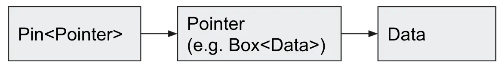
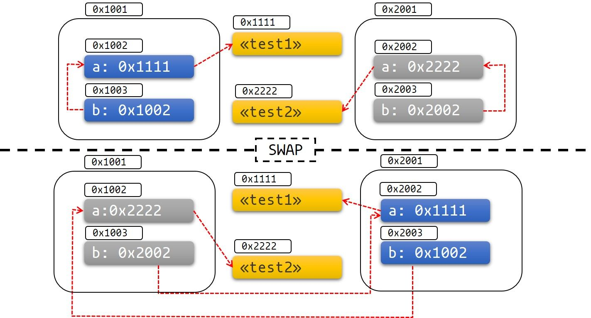

在Rust中，所有类型可以分为两类

* **类型的值可以在内存中安全地被移动**
* **自引用类型**

## 为何需要Pin

```rust
async {
    let mut x = [0; 128];
    let read_into_buf_fut = read_into_buf(&mut x);
    read_into_buf_fut.await;
    println!("{:?}", x);
}

// 编译后的形式
struct ReadIntoBuf<'a> {
    buf: &'a mut [u8], // 指向下面的`x`字段
}

struct AsyncFuture {
    x: [u8; 128],
    read_into_buf_fut: ReadIntoBuf<'what_lifetime?>,
}
```

​`ReadIntoBuf`​ 拥有一个引用字段，指向了结构体的另一个字段 `x`​ ，一旦 `AsyncFuture`​ 被移动，那 `x`​ 的地址也将随之变化，此时对 `x`​ 的引用就变成了不合法的，也就是 `read_into_buf_fut.buf`​ 会变为不合法的。

若能将 `Future`​ 在内存中固定到一个位置，就可以避免这种问题的发生，也就可以安全的创建上面这种引用类型。

## Unpin

绝大多数类型都不在意是否被移动(开篇提到的第一种类型)，因此它们都**自动实现**了 `Unpin`​ 特征。

​`Pin`​ 是一个结构体

* 可以被 `Pin`​ 住的值实现的特征是 `!Unpin`​
* 一个类型如果不能被移动，它必须实现 `!Unpin`​ 特征

```rust
// 包裹一个指针，确保该指针指向的数据不会被移动
pub struct Pin<P> {
    pointer: P,
}
```

​​

​`Unpin`​ 是一个特征，它表明一个类型可以随意被移动

* 实现了 `Unpin`​ 特征，还是可以 `Pin`​ 的，**但是不再有任何效果而已，该值一样可以被移动**！

对比Send/Sync:

* 都是标记特征( marker trait )，该特征未定义任何行为，非常适用于标记
* 都可以通过`!`​语法去除实现
* 绝大多数情况都是自动实现, 无需我们的操心

## 深入Pin

```rust
#[derive(Debug)]
struct Test {
    a: String,
    b: *const String,
}
impl Test {
    fn new(txt: &str) -> Self {
        Test {
            a: String::from(txt),
            b: std::ptr::null(),
        }
    }

    fn init(&mut self) {
        let self_ref: *const String = &self.a;
        self.b = self_ref;
    }

    fn a(&self) -> &str {
        &self.a
    }

    fn b(&self) -> &String {
        assert!(!self.b.is_null(), "Test::b called without Test::init being called first");
        unsafe { &*(self.b) }
    }
}

fn main() {
    let mut test1 = Test::new("test1");
    test1.init();
    let mut test2 = Test::new("test2");
    test2.init();

    println!("a: {}, b: {}", test1.a(), test1.b());
    std::mem::swap(&mut test1, &mut test2);
    println!("a: {}, b: {}", test2.a(), test2.b());

}

// 理论输出
a: test1, b: test1
a: test1, b: test1

// 实际输出
a: test1, b: test1
a: test1, b: test2

```

​​

## 实践

### 将值固定在栈上

```rust
use std::pin::Pin;
use std::marker::PhantomPinned;

#[derive(Debug)]
struct Test {
    a: String,
    b: *const String,
    _marker: PhantomPinned,
}


impl Test {
    fn new(txt: &str) -> Self {
        Test {
            a: String::from(txt),
            b: std::ptr::null(),
            _marker: PhantomPinned, // 这个标记可以让我们的类型自动实现特征`!Unpin`
        }
    }

    fn init(self: Pin<&mut Self>) {
        let self_ptr: *const String = &self.a;
        let this = unsafe { self.get_unchecked_mut() };
        this.b = self_ptr;
    }

    fn a(self: Pin<&Self>) -> &str {
        &self.get_ref().a
    }

    fn b(self: Pin<&Self>) -> &String {
        assert!(!self.b.is_null(), "Test::b called without Test::init being called first");
        unsafe { &*(self.b) }
    }
}
```

```rust
pub fn main() {
    // 此时的`test1`可以被安全的移动
    let mut test1 = Test::new("test1");
    // 新的`test1`由于使用了`Pin`，因此无法再被移动，这里的声明会将之前的`test1`遮蔽掉(shadow)
    let mut test1 = unsafe { Pin::new_unchecked(&mut test1) };
    Test::init(test1.as_mut());

    let mut test2 = Test::new("test2");
    let mut test2 = unsafe { Pin::new_unchecked(&mut test2) };
    Test::init(test2.as_mut());

    println!("a: {}, b: {}", Test::a(test1.as_ref()), Test::b(test1.as_ref()));
    std::mem::swap(test1.get_mut(), test2.get_mut());
    println!("a: {}, b: {}", Test::a(test2.as_ref()), Test::b(test2.as_ref()));
}

//错误
error[E0277]: `PhantomPinned` cannot be unpinned
   --> src/main.rs:47:43
    |
47  |     std::mem::swap(test1.get_mut(), test2.get_mut());
    |                                           ^^^^^^^ within `Test`, the trait `Unpin` is not implemented for `PhantomPinned`

```

### 固定到堆上

```rust
use std::pin::Pin;
use std::marker::PhantomPinned;

#[derive(Debug)]
struct Test {
    a: String,
    b: *const String,
    _marker: PhantomPinned,
}

impl Test {
    fn new(txt: &str) -> Pin<Box<Self>> {
        let t = Test {
            a: String::from(txt),
            b: std::ptr::null(),
            _marker: PhantomPinned,
        };
        let mut boxed = Box::pin(t);
        let self_ptr: *const String = &boxed.as_ref().a;
        unsafe { boxed.as_mut().get_unchecked_mut().b = self_ptr };

        boxed
    }

    fn a(self: Pin<&Self>) -> &str {
        &self.get_ref().a
    }

    fn b(self: Pin<&Self>) -> &String {
        unsafe { &*(self.b) }
    }
}

pub fn main() {
    let test1 = Test::new("test1");
    let test2 = Test::new("test2");

    println!("a: {}, b: {}",test1.as_ref().a(), test1.as_ref().b());
    println!("a: {}, b: {}",test2.as_ref().a(), test2.as_ref().b());
}

```

### 将固定的Future变为Unpin

若你使用的 `Future`​ 是 `!Unpin`​ 的，必须要使用以下的方法先将 `Future`​ 进行固定:

* ​`Box::pin`​， 创建一个 `Pin<Box<T>>`​
* ​`pin_utils::pin_mut!`​， 创建一个 `Pin<&mut T>`​

固定后获得的 `Pin<Box<T>>`​ 和 `Pin<&mut T>`​ 既可以用于 `Future`​ ，**又会自动实现 ​**​**`Unpin`**​

```rust
use pin_utils::pin_mut; // `pin_utils` 可以在crates.io中找到

// 函数的参数是一个`Future`，但是要求该`Future`实现`Unpin`
fn execute_unpin_future(x: impl Future<Output = ()> + Unpin) { /* ... */ }

let fut = async { /* ... */ };
// 下面代码报错: 默认情况下，`fut` 实现的是`!Unpin`，并没有实现`Unpin`
// execute_unpin_future(fut);

// 使用`Box`进行固定
let fut = async { /* ... */ };
let fut = Box::pin(fut);
execute_unpin_future(fut); // OK

// 使用`pin_mut!`进行固定
let fut = async { /* ... */ };
pin_mut!(fut);
execute_unpin_future(fut); // OK
```

## 总结

* 若 `T: Unpin`​ ( Rust 类型的默认实现)，那么 `Pin<'a, T>`​ 跟 `&'a mut T`​ 完全相同，也就是 `Pin`​ 将没有任何效果, 该移动还是照常移动
* 绝大多数标准库类型都实现了 `Unpin`​ ，事实上，对于 Rust 中你能遇到的绝大多数类型，该结论依然成立 ，其中一个例外就是：`async/await`​ 生成的 `Future`​ 没有实现 `Unpin`​
* 你可以通过以下方法为自己的类型添加 `!Unpin`​ 约束：

  * 使用文中提到的 `std::marker::PhantomPinned`​
  * 使用`nightly`​ 版本下的 `feature flag`​
* 可以将值固定到栈上，也可以固定到堆上

  * 将 `!Unpin`​ 值固定到栈上需要使用 `unsafe`​
  * 将 `!Unpin`​ 值固定到堆上无需 `unsafe`​ ，可以通过 `Box::pin`​ 来简单的实现
* 当固定类型`T: !Unpin`​时，你需要保证数据从被固定到被 drop 这段时期内，其内存不会变得非法或者被重用
