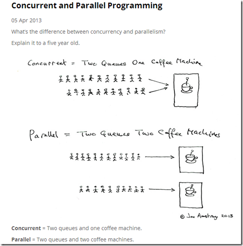

## 并行和并发

> 并发时同一时间应对多件事的能力

​​

* 并发和并行都是多任务处理, 其中并发是轮流处理, 并行是同时处理

### CPU多核

#### 单核心并发

* OS

  * 多线程任务队列代表多个排队的队列
  * CPU核心代表咖啡机
* 快速轮换处理不同任务, 给用户带来同时运行的假象

#### 多核心并行

* CPU核心增多N,同时就能有N个任务被处理,并行度是N

#### 多核心并发

* 并发和并行同时发生, 所有用户任务从表面看都在并发运行, 实际上同一时刻只有N个任务能被同时并行处理

### 正式定义

* 如果某个系统支持两个或者多个动作的**同时存在**，那么这个系统就是一个并发系统。如果某个系统支持两个或者多个动作**同时执行**，那么这个系统就是一个并行系统。并发系统与并行系统这两个定义之间的关键差异在于 **“存在”** 这个词。
* **“并行”概念是“并发”概念的一个子集**。也就是说，你可以编写一个拥有多个线程或者进程的并发程序，但如果没有多核处理器来执行这个程序，那么就不能以并行方式来运行代码。

### 编程语言的并发模型

不同语言对线程的实现:

* 1:1线程模型: 直接调用操作系统提供API创建线程,程序内线程数和该程序占用操作系统线程数相等, Rust
* M:N模型: 程序内M个线程通过映射方式使用N个操作系统线程去运行, Go协程
* 使用Actor模型,基于消息传递进行并发

## 使用多线程

### 多线程编程风险

* 竞态条件(race conditions)，多个线程以非一致性的顺序同时访问数据资源
* 死锁(deadlocks)，两个线程都想使用某个资源，但是又都在等待对方释放资源后才能使用，结果最终都无法继续执行
* 一些因为多线程导致的很隐晦的 BUG，难以复现和解决

### 创建线程

> 使用`thread::spawn`​创建

```rust
use std::thread;
use std::time::Duration;

fn main() {
    thread::spawn(|| {
        for i in 1..10 {
            println!("hi number {} from the spawned thread!", i);
            thread::sleep(Duration::from_millis(1));
        }
    });

    for i in 1..5 {
        println!("hi number {} from the main thread!", i);
        thread::sleep(Duration::from_millis(1));
    }
}
```

注意点:

* 线程内部代码使用闭包执行
* main线程结束, 程序就结束, 需要保持存活直到子线程完成
* ​`thread::sleep`​会让当前线程休眠指定实现
* 线程的执行顺序是无序的

### 等待子线程结束

```rust
use std::thread;
use std::time::Duration;

fn main() {
    let handle = thread::spawn(|| {
        for i in 1..5 {
            println!("hi number {} from the spawned thread!", i);
            thread::sleep(Duration::from_millis(1));
        }
    });

    handle.join().unwrap();

    for i in 1..5 {
        println!("hi number {} from the main thread!", i);
        thread::sleep(Duration::from_millis(1));
    }
}
```

注意点:

* 通过`handle.join()`​可以让当前线程阻塞

### 在线程闭包中使用move

> 闭包通过["move"](siyuan://blocks/20221204134152-c886x1o)关键字让闭包拿走环境中某个值的所有权, 同样可以使用move将所有权从一个线程转移到另一个线程

### 线程是如何结束的

代码执行完,线程自动结束

* 线程的任务是一个循环IO读取,绝大部分属于阻塞,CPU占用小
* 线程任务是一个循环,没有阻塞/休眠,CPU会被跑满, 并且在没有终止条件下,直到main线程结束

### 多线程的性能

#### 创建线程的性能

一个线程大约0.24ms, 线程越多值越大

#### 创建多少线程合适

* 不阻塞时, 线程数等于CPU核心数
* 阻塞时, 增多线程. 典型的有网络IO操作.一般更推荐async/await 的M:N 并发模型

#### 多线程的开销

多线程的开销往往是在锁, 数据竞争,缓存失效上

### 线程屏障(Barrier)

> 使用Barrier可以让多个线程都执行到某个点后, 才继续一起往后执行

### 线程局部变量(Thread Local Variable)

#### 标准库 thread_local

* 使用 thread_local 宏初始化, 然后再线程内使用变量的with方法获取变量

* 每个新线程访问局部变量都会使用他的初始值作为开始, 各个线程中的值互不干扰.

* 值使用 static 声明生命周期为'static的静态变量
* 还可以在结构体或引用的方式使用

#### 三方库 theard-local

```rust
use thread_local::ThreadLocal;
use std::sync::Arc;
use std::cell::Cell;
use std::thread;

let tls = Arc::new(ThreadLocal::new());

// 创建多个线程
for _ in 0..5 {
    let tls2 = tls.clone();
    thread::spawn(move || {
        // 将计数器加1
        let cell = tls2.get_or(|| Cell::new(0));
        cell.set(cell.get() + 1);
    }).join().unwrap();
}

// 一旦所有子线程结束，收集它们的线程局部变量中的计数器值，然后进行求和
let tls = Arc::try_unwrap(tls).unwrap();
let total = tls.into_iter().fold(0, |x, y| x + y.get());

// 和为5
assert_eq!(total, 5);
```

### 用条件控制线程的挂起和执行

> 条件变量(Condition Variables)和Mutex一起使用,可以让线程挂起, 直到条件发生再继续执行

```rust
use std::thread;
use std::sync::{Arc, Mutex, Condvar};

fn main() {

    let pair = Arc::new((Mutex::new(false), Condvar::new()));
    let pair2 = pair.clone();

    thread::spawn(move|| {
        let &(ref lock, ref cvar) = &*pair2;
        let mut started = lock.lock().unwrap();
        println!("changing started");
        // 子线程获取锁, 修改true, 然后用条件变量的notfy_one方法来通知主线继续执行
        *started = true;
        cvar.notify_one();
    });
    // main线程获取锁, 进入while循环调用wait方法等待子线程的通知, 并释放锁
    let &(ref lock, ref cvar) = &*pair;
    let mut started = lock.lock().unwrap();
    while !*started {
        started = cvar.wait(started).unwrap();
    }

    println!("started changed");
}
```

### 只被调用一次的函数

* 某函数在多线程环境下只被初始化一次

  * ```rust
    use std::sync::Once;
    static INIT: Once = Once::new();
    ```

* call_one方法

  * 执行初始化过程一次, 并只执行一次
  * 当有另一个初始化过程正在进行,线程将阻止该方法被调用

### 总结

[Rust 的线程模型](https://course.rs/advance/concurrency-with-threads/intro.html)是 `1:1`​ 模型，因为 Rust 要保持尽量小的运行时。

我们可以使用 `thread::spawn`​ 来创建线程，创建出的多个线程之间并不存在执行顺序关系，因此代码逻辑千万不要依赖于线程间的执行顺序。

​`main`​ 线程若是结束，则所有子线程都将被终止，如果希望等待子线程结束后，再结束 `main`​ 线程，你需要使用创建线程时返回的句柄的 `join`​ 方法。

在线程中无法直接借用外部环境中的变量值，因为新线程的启动时间点和结束时间点是不确定的，所以 Rust 无法保证该线程中借用的变量在使用过程中依然是合法的。你可以使用 `move`​ 关键字将变量的所有权转移给新的线程，来解决此问题。

父线程结束后，子线程仍在持续运行，直到子线程的代码运行完成或者 `main`​ 线程的结束

## 线程间的消息传递

### 消息通道

* 一个通道支持多个发送者和接收者
* 多发送者 -> 单接收者
* 多发送者 -> 多接收者

### 多发送者, 单接收者

> 标准库提供通道 std::sync::mpsc, 其中mpsc是 multiple producer, single consumer的缩写

```rust
use std::sync::mpsc;
use std::thread;

fn main() {
    // 创建一个消息通道, 返回一个元组：(发送者，接收者)
    let (tx, rx) = mpsc::channel();

    // 创建线程，并发送消息
    // 需要使用move转移tx的所有权到子线程的闭包中
    thread::spawn(move || {
        // 发送一个数字1, send方法返回Result<T,E>，通过unwrap进行快速错误处理
        tx.send(1).unwrap();

        // 下面代码将报错，因为编译器自动推导出通道传递的值是i32类型，那么Option<i32>类型将产生不匹配错误
        // tx.send(Some(1)).unwrap()
    });

    // 在主线程中接收子线程发送的消息并输出
    // rx.recv方法会阻塞当前线程,直到读取值或通道关闭
    println!("receive {}", rx.recv().unwrap());
}
```

#### 不阻塞方法 try_recv 方法

该方法不会阻塞线程, 当通道中没有消息时会立刻返回一个错误

### 传输具有所有权的数据

* 传输数据也需要遵循所有权规则

  * 若值类型实现Copy特征,则直接复制
  * 若值没有实现Copy, 则转移所有权到接收端

### 使用for进行循环接收

```rust
use std::sync::mpsc;
use std::thread;
use std::time::Duration;

fn main() {
    let (tx, rx) = mpsc::channel();

    thread::spawn(move || {
        let vals = vec![
            String::from("hi"),
            String::from("from"),
            String::from("the"),
            String::from("thread"),
        ];

        for val in vals {
            tx.send(val).unwrap();
            thread::sleep(Duration::from_secs(1));
        }
    });

    for received in rx {
        println!("Got: {}", received);
    }
}
```

### 使用多发送者

```rust
use std::sync::mpsc;
use std::thread;

fn main() {
    let (tx, rx) = mpsc::channel();
    // 多一个对发送者的克隆
    let tx1 = tx.clone();
    thread::spawn(move || {
        tx.send(String::from("hi from raw tx")).unwrap();
    });

    thread::spawn(move || {
        tx1.send(String::from("hi from cloned tx")).unwrap();
    });

    for received in rx {
        println!("Got: {}", received);
    }
}
```

* 需要所有的发送者都被`drop`​掉后，接收者`rx`​才会收到错误，进而跳出`for`​循环，最终结束主线程
* 这里虽然用了`clone`​但是并不会影响性能，因为它并不在热点代码路径中，仅仅会被执行一次
* 由于两个子线程谁先创建完成是未知的，因此哪条消息先发送也是未知的，最终主线程的输出顺序也不确定

### 同步和异步通道

* 异步通道

  * 无论是否接收者接收消息,消息发送者都不会阻塞\
* 同步通道

  * 发送消息是阻塞的, 只有消息接收后才会解除
  * 使用`mpsc::sync_channel(0)`​
* 消息缓存

  * ​`mpsc::sync_channel(0)`​中的数值表示缓存消息数量, 消耗完改数量消息后才会出现阻塞
  * 异步消息在消息未处理时容易出现内存过大, 实际项目中考虑使用带缓冲的同步通道避免

### 关闭通道

* 所有发送者被drop 或者所有接收者被drop 后, 通道自动关闭
* 该实现在编译期实现, 没有运行期损耗

### 传输多种类型的数据

* 一个消息只能传输一种类型数据,实现上述需求:

  * 为每一种类型创建一个通道
  * 使用枚举类型实现

    * rust会按照枚举中占用内存最大的成员做内存对齐, 对造成内存浪费

### 新手遇到的坑

```rust
use std::sync::mpsc;
fn main() {

    use std::thread;
  
    let (send, recv) = mpsc::channel();
    let num_threads = 3;
    for i in 0..num_threads {
        let thread_send = send.clone();
        // 子线程拿走的是复制后的send的所有权，这些拷贝会在子线程结束后被drop
        thread::spawn(move || {
            thread_send.send(i).unwrap();
            println!("thread {:?} finished", i);
        });
    }

    // 在这里drop send...
    // 没有手动drop send导致循环无法结束, main线程一直卡死

    for x in recv {
        println!("Got: {}", x);
    }
    println!("finished iterating");
    // send需要函数结束才会drop
}
```

### mpmc更好的性能

如果你需要 mpmc(多发送者，多接收者)或者需要更高的性能，可以考虑第三方库:

* **[crossbeam-channel](https://github.com/crossbeam-rs/crossbeam/tree/master/crossbeam-channel)**, 老牌强库，功能较全，性能较强，之前是独立的库，但是后面合并到了`crossbeam`​主仓库中
* **[flume](https://github.com/zesterer/flume)**, 官方给出的性能数据某些场景要比 crossbeam 更好些

## 线程同步: 锁, Condvar, 信号量

> 在 Rust 中有多种方式可以实现同步性。在上一节中讲到的消息传递就是同步性的一种实现方式，例如我们可以通过消息传递来控制不同线程间的执行次序。还可以使用共享内存来实现同步性，例如通过锁和原子操作等并发原语来实现多个线程同时且安全地去访问一个资源。

### 该如何选择

* 共享内存

  * 共享内存相对消息传递能节省多次内存拷贝的成本
  * 共享内存的实现简洁的多
  * 共享内存的锁竞争更多
  * 简洁的实现以及高性能
  * 类似多所有权, 多个线程可以访问同一值
* 消息传递,底层实质也是共享内存

  * 需要可靠和简单的(简单不等于简洁)实现时
  * 需要模拟现实世界，例如用消息去通知某个目标执行相应的操作时
  * 需要一个任务处理流水线(管道)时，等等
  * 类似单所有权, 一个值只有一个所有权

### 互斥锁 Mutex(mutual exclusion)

#### 单线程使用

```rust
use std::sync::Mutex;

fn main() {
    // 使用`Mutex`结构体的关联函数创建新的互斥锁实例
    let m = Mutex::new(5);

    {
        // 获取锁，然后deref为`m`的引用
        // lock返回的是Result
        let mut num = m.lock().unwrap();
        *num = 6;
        // 锁自动被drop
    }

    println!("m = {:?}", m);
}
```

* 注意点

  * 访问内部数据需要使用方法m.lock(), 该方法会阻塞当前线程,直到获取锁
  * m.lock() 方法可能报错, 例如有其他线程panic,lock方法会返回一个错误
  * m.lock() 返回一个["智能指针"](siyuan://blocks/20221204173641-8n9gxz7) MutexGuard<T>

    * 实现了Deref特征, 自动解引用后获得一个引用类型, 指向了内部数据
    * 实现了Drop特征, 超出作用域后自动释放锁

#### 多线程中使用mutex

Rc<T>非线程安全, 无法在线程中安全传输,没有实现Send特征

```rust
use std::rc::Rc;
use std::sync::Mutex;
use std::thread;

fn main() {
    // 通过`Rc`实现`Mutex`的多所有权
    let counter = Rc::new(Mutex::new(0));
    let mut handles = vec![];

    for _ in 0..10 {
        let counter = Rc::clone(&counter);
        // 创建子线程，并将`Mutex`的所有权拷贝传入到子线程中
        let handle = thread::spawn(move || {
            let mut num = counter.lock().unwrap();

            *num += 1;
        });
        handles.push(handle);
    }

    // 等待所有子线程完成
    for handle in handles {
        handle.join().unwrap();
    }

    // 输出最终的计数结果
    println!("Result: {}", *counter.lock().unwrap());
}
```

Arc<T>的内部计数器是线程安全的,因此可以正常使用

#### 内部可变性

* Rc<T>和RefCell<T>的结合,实现单线程内部可变性
* Arc<T>和Mutex<T>用于多线程内部可变性

#### 小心使用Mutex

互斥锁

* 在使用数据前必须获得锁
* 在数据完成后必须及时释放锁

#### 死锁(deadlock)

> 当一个操作试图锁住两个资源,然后两个线程获取其中一个锁, 并试图获取另一个锁时,就会造成死锁

* 单线程死锁

  * ```rust
    use std::sync::Mutex;

    fn main() {
        let data = Mutex::new(0);
        let d1 = data.lock();
        let d2 = data.lock();
    } // d1锁在此处释放
    ```
  * 另一个锁还未被释放时去申请新的锁会出现
* 多线程死锁

  * 当我们拥有两个锁, 且两个线程各自使用了其中一个锁,然后试图访问另一个锁时,就可能发生死锁
  * ```rust
    use std::{sync::{Mutex, MutexGuard}, thread};
    use std::thread::sleep;
    use std::time::Duration;

    use lazy_static::lazy_static;
    lazy_static! {
        static ref MUTEX1: Mutex<i64> = Mutex::new(0);
        static ref MUTEX2: Mutex<i64> = Mutex::new(0);
    }

    fn main() {
        // 存放子线程的句柄
        let mut children = vec![];
        for i_thread in 0..2 {
            children.push(thread::spawn(move || {
                for _ in 0..1 {
                    // 线程1
                    if i_thread % 2 == 0 {
                        // 锁住MUTEX1
                        let guard: MutexGuard<i64> = MUTEX1.lock().unwrap();

                        println!("线程 {} 锁住了MUTEX1，接着准备去锁MUTEX2 !", i_thread);

                        // 当前线程睡眠一小会儿，等待线程2锁住MUTEX2
                        sleep(Duration::from_millis(10));

                        // 去锁MUTEX2
                        let guard = MUTEX2.lock().unwrap();
                    // 线程2
                    } else {
                        // 锁住MUTEX2
                        let _guard = MUTEX2.lock().unwrap();

                        println!("线程 {} 锁住了MUTEX2, 准备去锁MUTEX1", i_thread);

                        let _guard = MUTEX1.lock().unwrap();
                    }
                }
            }));
        }

        // 等子线程完成
        for child in children {
            let _ = child.join();
        }

        println!("死锁没有发生");
    }
    ```
  *  死锁并不是必然发生的
* try_lock

  * 该方法会尝试获取一次锁, 如果无法获取会返回一个错误, 因此不会发生阻塞
  * ```rust
    use std::{sync::{Mutex, MutexGuard}, thread};
    use std::thread::sleep;
    use std::time::Duration;

    use lazy_static::lazy_static;
    lazy_static! {
        static ref MUTEX1: Mutex<i64> = Mutex::new(0);
        static ref MUTEX2: Mutex<i64> = Mutex::new(0);
    }

    fn main() {
        // 存放子线程的句柄
        let mut children = vec![];
        for i_thread in 0..2 {
            children.push(thread::spawn(move || {
                for _ in 0..1 {
                    // 线程1
                    if i_thread % 2 == 0 {
                        // 锁住MUTEX1
                        let guard: MutexGuard<i64> = MUTEX1.lock().unwrap();

                        println!("线程 {} 锁住了MUTEX1，接着准备去锁MUTEX2 !", i_thread);

                        // 当前线程睡眠一小会儿，等待线程2锁住MUTEX2
                        sleep(Duration::from_millis(10));

                        // 去锁MUTEX2
                        let guard = MUTEX2.try_lock();
                        println!("线程1获取MUTEX2锁的结果: {:?}",guard);
                    // 线程2
                    } else {
                        // 锁住MUTEX2
                        let _guard = MUTEX2.lock().unwrap();

                        println!("线程 {} 锁住了MUTEX2, 准备去锁MUTEX1", i_thread);
                        sleep(Duration::from_millis(10));
                        let guard = MUTEX1.try_lock();
                        println!("线程2获取MUTEX1锁的结果: {:?}",guard);
                    }
                }
            }));
        }

        // 等子线程完成
        for child in children {
            let _ = child.join();
        }

        println!("死锁没有发生");
    }
    ```
  * 当try_lock失败时,会抛出一个错误:Err("WouldBlock"),接着线程中的剩余代码会继续执行

### 读写锁

> Mutex会每次读写进行加锁,但需要大量并发读时,就无法满足,因此可以使用Rwlock

```rust
use std::sync::RwLock;

fn main() {
    let lock = RwLock::new(5);

    // 同一时间允许多个读
    {
        let r1 = lock.read().unwrap();
        let r2 = lock.read().unwrap();
        assert_eq!(*r1, 5);
        assert_eq!(*r2, 5);
    } // 读锁在此处被drop

    // 同一时间只允许一个写
    {
        let mut w = lock.write().unwrap();
        *w += 1;
        assert_eq!(*w, 6);

        // 以下代码会panic，因为读和写不允许同时存在
        // 写锁w直到该语句块结束才被释放，因此下面的读锁依然处于`w`的作用域中
        // let r1 = lock.read();
        // println!("{:?}",r1);
    }// 写锁在此处被drop
}
```

总结:

* 同时允许读,最多一个写
* 读写不能同时存在
* 读可以使用read,try_read,写write,try_write,在实际中try_xxx会更安全

### Mutex和Rwlock

* 二者区别

  * 使用简单性角度

    * 读写不能同时发生,使用try_xxx需要做大量错误处理和失败重试
    * 当读多写少时,写操作可能会因为一直无法获取锁导致连续多次失败(writer starvation)
    * Rwlock是操作系统提供, 实现原理比Mutex复杂,性能而言比不上Mutex
  * 使用场景

    * 高并发读取时使用Rwlock
    * 保证写操作成功性,使用Mutex
    * 不知道哪个统一使用Mutex
  * 其他:

    *  使用HashMap进行简单读写,而HashMap的读写非常快,更适合Mutex
    * 使用RwLock确保两个条件: 并发读, 且需要对读到的资源进行长时间操作
* 三方库提供的锁实现

  * [parking_lot](https://crates.io/crates/parking_lot), 功能更完善、稳定，社区较为活跃，star 较多，更新较为活跃
  * [spin](https://crates.io/crates/spin), 在多数场景中性能比`parking_lot`​高一点，最近没怎么更新

### 使用条件变量(Condvar)控制线程同步

> 解决资源访问顺序, 使用条件变量(Condition Variables), 经常与Mutex使用

```rust
use std::sync::{Arc,Mutex,Condvar};
use std::thread::{spawn,sleep};
use std::time::Duration;

fn main() {
    let flag = Arc::new(Mutex::new(false));
    let cond = Arc::new(Condvar::new());
    let cflag = flag.clone();
    let ccond = cond.clone();

    let hdl = spawn(move || {
        let mut m = { *cflag.lock().unwrap() };
        let mut counter = 0;

        while counter < 3 {
            while !m {
                m = *ccond.wait(cflag.lock().unwrap()).unwrap();
            }

            {
                m = false;
                *cflag.lock().unwrap() = false;
            }

            counter += 1;
            println!("inner counter: {}", counter);
        }
    });

    let mut counter = 0;
    loop {
        sleep(Duration::from_millis(1000));
        *flag.lock().unwrap() = true;
        counter += 1;
        if counter > 3 {
            break;
        }
        println!("outside counter: {}", counter);
        cond.notify_one();
    }
    hdl.join().unwrap();
    println!("{:?}", flag);
}


outside counter: 1
inner counter: 1
outside counter: 2
inner counter: 2
outside counter: 3
inner counter: 3
Mutex { data: true, poisoned: false, .. }
```

### 信号量(Semaphore)

> 使用它能控制当前正在运行任务的最大数量. 
>
> 当前推荐使用`tokio::sync::Semaphore`​

```rust
use std::sync::Arc;
use tokio::sync::Semaphore;

#[tokio::main]
async fn main() {
    let semaphore = Arc::new(Semaphore::new(3));
    let mut join_handles = Vec::new();

    for _ in 0..5 {
        let permit = semaphore.clone().acquire_owned().await.unwrap();
        join_handles.push(tokio::spawn(async move {
            //
            // 在这里执行任务...
            //
            drop(permit);
        }));
    }

    for handle in join_handles {
        handle.await.unwrap();
    }
}
```

## 线程同步: Atomic 原子类型与内存顺序

> 原子: 一系列不可被CPU上下文交换的机器指令;
>
> 在多核CPU下, 当某个CPU开始运行原子操作时, 会暂停其他内核对内存的操作;
>
> 通过指令提供支持, 性能相比锁和消息传递好很多.
>
> * 不需要处理加锁,释放锁的问题
> * 支持修改,读取操作
> * 具备较高的并发性能
>
> 原子类型是无锁类型, 内部使用`CAS`​ 循环,大量冲突发生时仍然需要等待

> CAS 全称是 Compare and swap, 它通过一条指令读取指定的内存地址，然后判断其中的值是否等于给定的前置值，如果相等，则将其修改为新的值

### 使用Atomic作为全局变量

```rust
use std::ops::Sub;
use std::sync::atomic::{AtomicU64, Ordering};
use std::thread::{self, JoinHandle};
use std::time::Instant;

const N_TIMES: u64 = 10000000;
const N_THREADS: usize = 10;

// 设置全局变量
static R: AtomicU64 = AtomicU64::new(0);

fn add_n_times(n: u64) -> JoinHandle<()> {
    thread::spawn(move || {
        for _ in 0..n {
	    // 全局变量+1
            R.fetch_add(1, Ordering::Relaxed);
        }
    })
}

fn main() {
    let s = Instant::now();
    // 创建10个线程的数组
    let mut threads = Vec::with_capacity(N_THREADS);

    for _ in 0..N_THREADS {
	// 执行方法
        threads.push(add_n_times(N_TIMES));
    }
 
    // 循环线程数组
    for thread in threads {
        thread.join().unwrap();
    }

    assert_eq!(N_TIMES * N_THREADS as u64, R.load(Ordering::Relaxed));

    println!("{:?}",Instant::now().sub(s));
}
```

内存顺序

影响因素:

* 代码中的先后顺序
* 编译器优化导致在编译阶段发生改变(内存重排, reordering)
* 运行阶段因CPU的缓存机制导致顺序被打乱

限定内存顺序的5个规则

* ​**Relaxed**​， 这是最宽松的规则，它对编译器和 CPU 不做任何限制，可以乱序
* ​**Release 释放**​，设定内存屏障(Memory barrier)，保证它之前的操作永远在它之前，但是它后面的操作可能被重排到它前面
* ​**Acquire 获取**​, 设定内存屏障，保证在它之后的访问永远在它之后，但是它之前的操作却有可能被重排到它后面，往往和`Release`​在不同线程中联合使用
* ​**AcqRel**​, 是 *Acquire* 和 *Release* 的结合，同时拥有它们俩提供的保证。比如你要对一个 `atomic`​ 自增 1，同时希望该操作之前和之后的读取或写入操作不会被重新排序
* ​**SeqCst 顺序一致性**​， `SeqCst`​就像是`AcqRel`​的加强版，它不管原子操作是属于读取还是写入的操作，只要某个线程有用到`SeqCst`​的原子操作，线程中该`SeqCst`​操作前的数据操作绝对不会被重新排在该`SeqCst`​操作之后，且该`SeqCst`​操作后的数据操作也绝对不会被重新排在`SeqCst`​操作前。

内存顺序的选择

1. 不知道怎么选择时，优先使用`SeqCst`​，虽然会稍微减慢速度，但是慢一点也比出现错误好
2. 多线程只计数`fetch_add`​而不使用该值触发其他逻辑分支的简单使用场景，可以使用`Relaxed`​  
    参考 [Which std::sync::atomic::Ordering to use?](https://stackoverflow.com/questions/30407121/which-stdsyncatomicordering-to-use)

### 多线程中使用Atomic

> 需要配合Arc

```rust
use std::sync::Arc;
use std::sync::atomic::{AtomicUsize, Ordering};
use std::{hint, thread};

fn main() {
    let spinlock = Arc::new(AtomicUsize::new(1));

    let spinlock_clone = Arc::clone(&spinlock);
    let thread = thread::spawn(move|| {
        spinlock_clone.store(0, Ordering::SeqCst);
    });

    // 等待其它线程释放锁
    while spinlock.load(Ordering::SeqCst) != 0 {
        hint::spin_loop();
    }

    if let Err(panic) = thread.join() {
        println!("Thread had an error: {:?}", panic);
    }
}
```

### Atomic能代替锁吗

* 对于复杂的场景下，锁的使用简单粗暴，不容易有坑
* ​`std::sync::atomic`​包中仅提供了数值类型的原子操作：`AtomicBool`​, `AtomicIsize`​, `AtomicUsize`​, `AtomicI8`​, `AtomicU16`​等，而锁可以应用于各种类型
* 在有些情况下，必须使用锁来配合，例如上一章节中使用`Mutex`​配合`Condvar`​

### 应用场景

* 无锁(lock free)数据结构
* 全局变量，例如全局自增 ID, 在后续章节会介绍
* 跨线程计数器，例如可以用于统计指标

## 基于Send和Sync的线程安全

### Send和Sync

作用:

* 实现`Send`​的类型可以在线程间安全的传递其所有权
* 实现`Sync`​的类型可以在线程间安全的共享(通过引用)

  * 指向的引用必须在线程间能传递

### 实现Send和Sync类型

* Rust中绝大数类型实现了Send和Sync, 除了以下:

  * ​`UnsafeCell`​不是`Sync`​，因此`Cell`​和`RefCell`​也不是
  * 裸指针两者都没实现，因为它本身就没有任何安全保证
  * ​`Rc`​两者都没实现(因为内部的引用计数器不是线程安全的)

* 自定义复合类型: 只要复合类型中有一个成员不是Send 或 Sync, 那么该复合类型也就不是Send或Sync

```rust
use std::thread;
use std::sync::Arc;
use std::sync::Mutex;

#[derive(Debug)]
struct MyBox(*const u8);
unsafe impl Send for MyBox {}
unsafe impl Sync for MyBox {}

fn main() {
    let b = &MyBox(5 as *const u8);
    let v = Arc::new(Mutex::new(b));
    let t = thread::spawn(move || {
        let _v1 =  v.lock().unwrap();
    });

    t.join().unwrap();
}
```

‍
