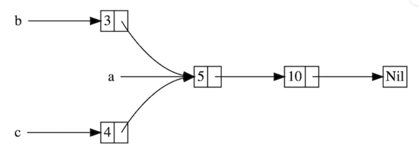
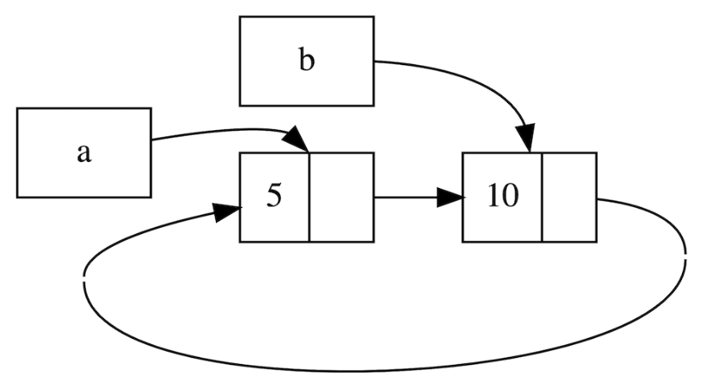

## Weak和循环引用

> 同时使用Rc<T>和RefCell<T>创建循环引用, 所有引用的计数无法清零,Rc<T>拥有的值也不会释放

‍

### 何为循环引用

```rust
use crate::List::{Cons, Nil};
use std::cell::RefCell;
use std::rc::Rc;

#[derive(Debug)]
enum List {
    Cons(i32, RefCell<Rc<List>>),
    Nil,
}

impl List {
    fn tail(&self) -> Option<&RefCell<Rc<List>>> {
        match self {
            Cons(_, item) => Some(item),
            Nil => None,
        }
    }
}

fn main() {}
```

它的每个值都指向了另一个 `List`​，此外，得益于 `Rc`​ 的使用还允许多个值指向一个 `List`​:

​

a -> b -> a -> b ....

​​

### Weak

> Weak 不持有所有权, 进保存一份弱引用: 访问数据通过upgrade方法实现. 返回一个Option<Rc<T>>,  不保证引用关系依然存在; 并且由于引用不计入所有权, 无法阻止引用的内存被释放

#### Weak和Rc的比较

|​`Weak`​|​`Rc`​|
| ------------------------------------| --------------------------------------|
|不计数|引用计数|
|不拥有所有权|拥有值的所有权|
|不阻止值被释放(drop)|所有权计数归零，才能 drop|
|引用的值存在返回 `Some`​，不存在返回 `None`​|引用的值必定存在|
|通过 `upgrade`​ 取到 `Option<Rc<T>>`​，然后再取值|通过 `Deref`​ 自动解引用，取值无需任何操作|

#### Weak总结

* 使用

  * 对于父子引用关系,使用父节点通过Rc来引用子节点,然后让子节点通过Weak引用父节点
* Weak通过`use std::rc::Weak 来引入,具有以下特点

  * 可访问，但没有所有权，不增加引用计数，因此不会影响被引用值的释放回收
  * 可由 `Rc<T>`​ 调用 `downgrade`​ 方法转换成 `Weak<T>`​
  * ​`Weak<T>`​ 可使用 `upgrade`​ 方法转换成 `Option<Rc<T>>`​，如果资源已经被释放，则 `Option`​ 的值是 `None`​
  * 常用于解决循环引用的问题

示例

```rust
use std::cell::RefCell;
use std::rc::{Rc, Weak};

#[derive(Debug)]
struct Node {
    value: i32,
    parent: RefCell<Weak<Node>>,
    children: RefCell<Vec<Rc<Node>>>,
}

fn main() {
    let leaf = Rc::new(Node {
        value: 3,
        parent: RefCell::new(Weak::new()),
        children: RefCell::new(vec![]),
    });

    // 自身一份为强,没有做弱引用: 1,0
    println!(
        "leaf strong = {}, weak = {}",
        Rc::strong_count(&leaf),
        Rc::weak_count(&leaf),
    );

    {
        let branch = Rc::new(Node {
            value: 5,
            parent: RefCell::new(Weak::new()),
            children: RefCell::new(vec![Rc::clone(&leaf)]),
        });

        *leaf.parent.borrow_mut() = Rc::downgrade(&branch);
    	// 自身一份为强引,做leaf弱引1: 1,1
        println!(
            "branch strong = {}, weak = {}",
            Rc::strong_count(&branch),
            Rc::weak_count(&branch),
        );
    	// 自身1 branch 1,没有做弱引用: 2,0
        println!(
            "leaf strong = {}, weak = {}",
            Rc::strong_count(&leaf),
            Rc::weak_count(&leaf),
        );
    // branch销毁, leaf的父节点销毁
    }
    // None
    println!("leaf parent = {:?}", leaf.parent.borrow().upgrade());
    // 自身1,没有做弱引用: 1,0
    println!(
        "leaf strong = {}, weak = {}",
        Rc::strong_count(&leaf),
        Rc::weak_count(&leaf),
    );
}
```

## 结构体自引 todo

https://course.rs/advance/circle-self-ref/self-referential.html

‍
